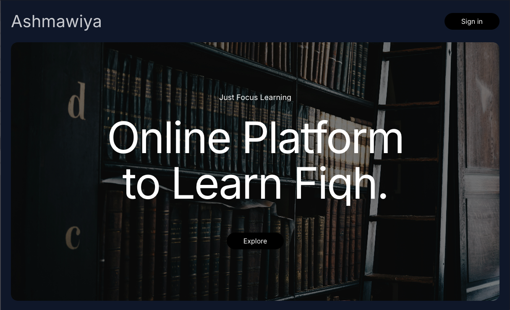

# ASHMAWIYA

## LEARNING PLATFORM FOR [FAQIHNAFSAK](https://faqihnafsak.com)'s al ashmaiya lecture

### Tech Stack

- [Express.js](https://expressjs.com/) as backend
- [React](https://reactjs.org/) as frontend library
- [TypeScript](https://www.typescriptlang.org/) as programming language
- [Prisma](https://prisma.io/) as database ORM
- [PostgreSQL](https://www.postgresql.org/) as database
- [Vite](https://vitejs.dev/) as bundler
- [DaisyUI](https://daisyui.com/) as Tailwind UI library
- [ESLint](https://eslint.org/) as code linting tool
- **Etc.**

### Ashmawiya Courses Rights

belong to [Faqihnafsak](https://faqihnafsak.com)
